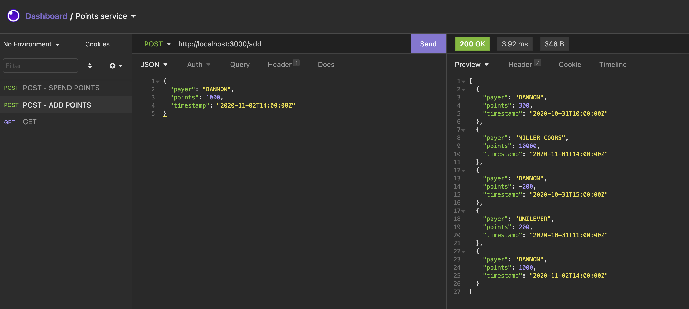
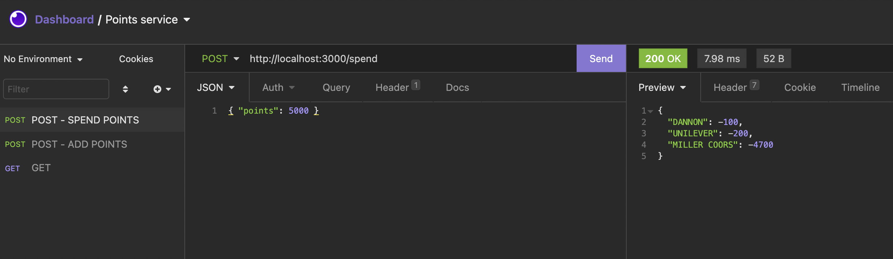
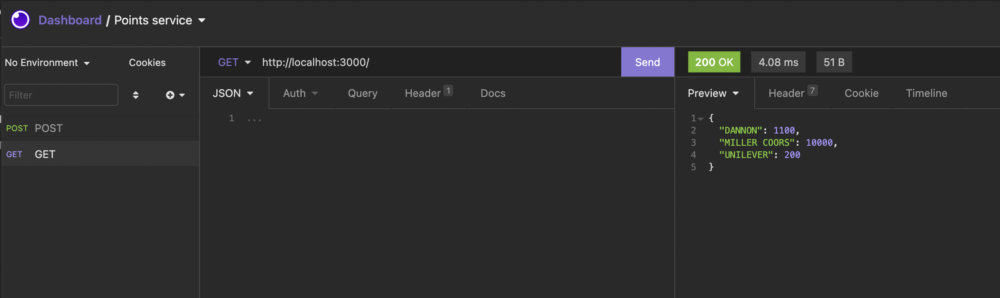

# points-service

## Description
A web service that accepts HTTP requests and updates points in user's accounts. Each transaction record contains: ​payer​ (string), ​points​ (integer), ​timestamp​ (date). 

  ## Table of Contents

* [Functionality](#functionality)
* [Installation](#installation)
* [License](#license)
* [Questions](#questions)

## Functionality
For earning points it is easy to assign a payer, we know which actions earned the points. And thus which partner should be paying for the points.

When a user spends points, they don't know or care which payer the points come from. But, our accounting team does care how the points are spent. There are two rules for determining what points to "spend" first:

- We want the oldest points to be spent first (oldest based on transaction timestamp, not the order they’re received)
- We want no payer's points to go negative.

It provides routes that:

- Add transactions for a specific payer and date. (`POST ROUTE: http://localhost:3000/add`)

- Spend points using the rules above and return a list of ​{ "payer": <string>, "points": <integer> }​ for each call. (`POST ROUTE: http://localhost:3000/spend`)

- Return all payer point balances. (`GET ROUTE: http://localhost:3000/`)

## Installation 
Clone the repo, run `npm i` to install the dependencies. 

To start the application, run from the root directory:
`npm start`. 

Use [Insomnia Core](https://insomnia.rest/products/insomnia) to test the routes.

## License

## Questions
If you have any questions about this project, send me an email at lizethariasc14@gmail.com or contact me through my [GitHub](https://github.com/lizariasc).